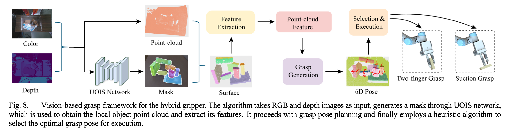

<!-- ---
permalink: /
title: "Yicheng"
author_profile: true
redirect_from: 
  - /about/
  - /about.html
header:
  show_title: false
--- -->

<section id="about_me">
    
</section>

# About me
I'm Yicheng, a student passionate about AI and robotics. I hold a Bachelor's degree in Optoelectronic Information Engineering from **Zhejiang University**, where I was an active member of the **[Grasp Lab](https://grasplab2022.github.io/)**. This experience allowed me to develop a strong foundation in **robotics**, focusing on the perception of robotic grasping.

I am pursuing a Master's degree in **Machine Learning** at the School of Electrical and Electronic Engineering at **Nanyang Technological University** to further my academic and research aspirations in robotics. In parallel, I am deepening my practical expertise as an intern at [**ASTAR SIMTech ARM**](https://www.a-star.edu.sg/simtech/research/adaptive-robotics-and-mechatronics-(arm)), where I am engaged in **advanced robotics research**.

<!-- Here is my [**CV**](../assets/CV.pdf). -->
<!-- <section id="reach_me">
    
</section> -->

------
# Reach me by:  
***<u>Email:</u>***  yichatma@gmail.com  

***<u>Github:</u>***  [yichatani](https://github.com/yichatani)  

***<u>Wechat:</u>***  [Ani](../images/wechat.JPG)  

<section id="research_interests">
    
</section>

------
# Research Interests
My research focuses on the intersection of **robotic perception, control, and intelligent manipulation**. Specifically, I am interested in:

- Developing sensorimotor models to integrate perception and control for robotic grasping.
- **Exploring machine learning methods**, such as deep learning and reinforcement learning, to enhance robotic decision-making and adaptability.
- Advancing techniques in robotic grasping and manipulation, including **vision-based control** and **multi-modal sensor fusion**, for real-world applications.

<section id="research_experience">
    
</section>

------
# Research Experience
### ASTAR SIMTech ARM, Singapore
**Research Intern**   
*Sep 2024 – Present*  
**Topic: Robotic Manipulation System using Advanced Deep Learning Technique**
- Developed a UR10e grasping system designed to operate in uncertain and dynamic clustered environments. This project involves exploring and leveraging RTDE (Real-Time Data Exchange) as a motion planning tool to enhance system reliability and responsiveness.  
- Enhanced the functionality of AnyGrasp, a state-of-the-art grasp generator, by **integrating the Grasp-1Billion dataset with MetaGraspNet**. This integration requires preprocessing and aligning the datasets to ensure consistency in their structure and arrangement, enabling seamless application and improved grasping performance.
- Conducted simulations using NVIDIA Isaac Sim, replicating the grasping system in a simulated environment to evaluate its performance under various scenarios. Currently, I am exploring novel methods to **transform task-agnostic grasp detectors into task-oriented systems**. Potential approaches include leveraging Diffusion models or Reinforcement Learning (RL).
- Planning to submit research findings and contributions to ***RA-L***, focusing on innovative techniques and their applications in robotic grasping systems.    

          

-----
### Grasp Lab, Zhejiang University  
**Graduation Project and Thesis**    
*Sep 2023 - Jun 2024*  
**Topic: Research on static and dynamic grasping of robots for warehousing and logistics applications**   
- **Constructed a geometric grasping module for grasp generation.** The method refers to the GSNet model architecture, using graspness to measure points in the point cloud suitable for grasping and extracting local and global high-dimensional point cloud features. Then, it extracts point-wise grasping degrees and subsequent viewpoint-wise grasping degrees, sets a graspness threshold to filter target point clouds, and generates grasps based on the filtered target point clouds, achieving static grasp generation.  
- **Built a dynamic tracking module based on time-based graspness.** It refers to AnyGrasp, using multi-threaded high-dimensional feature vectors to represent each grasp in each frame, calculating cosine similarity to measure the similarity between high-dimensional feature vectors, and using this to measure the correspondence of temporal dimensions between grasps in frames, achieving continuous generation of dynamic tracking poses.   
- **Established a robot motion control and path planning system.** It based on ROS, utilizes ROS's distributed communication architecture to connect and communicate between nodes. Motion control and path planning mainly use MoveIt API to write robot control modes and path planning, achieving multidimensional control of the robotic arm system.   
- **Designed static and dynamic experiments for robot new object grasping.** Static experiments include parcel grasping experiments and daily necessities grasping experiments to verify the generalization ability of the constructed robot new object grasping system. Dynamic experiments involve grasping parcels moving on conveyor belts to verify their dynamic grasping capability. Through experimental verification, this article demonstrates that the robot learning-based unknown object grasping system constructed in this article exhibits good performance in both static and dynamic object grasping scenarios.   

  

<section id="publications">
    
</section>

------

# Publications
<!-- ------ -->

**Construction of Bin-picking System for Logistic Application: A Hybrid Robotic Gripper and Vision-based Grasp Planning**

Zhian Su, **Yicheng Ma**, Haotian Guo, and Huixu Dong

**Abstract—** An autonomous bin-picking system for grasping various cluttered packages can significantly benefit logistics by reducing manual labor and streamlining processing. The system’s key challenges involve the gripper for confined spaces and grasp planning for unseen objects with varying materials, shapes, and sizes. To address these issues effectively, we propose a bin-picking system that includes a novel gripper and a corresponding vision-based grasp planning strategy. Firstly, a multi-mode hybrid gripper combining suction and pinch is developed to enhance versatility, as pinch alone fails for oversize objects and suction struggles with uneven surfaces. By integrating the suction cup into a slender finger and employing a flipping module and underactuated linkages, the compactness and dexterity are enhanced, ensuring the handling of packages near the bin walls or corners. Secondly, a model-free heuristic grasp planning framework based on the unseen object instance segmentation (UOIS) network is designed for grasping packages in a cluttered bin, which can be applied to hybrid grippers. Thirdly, we compared the prototype’s hardware characteristics with Hand-E and conducted grasping experiments to demonstrate the functionalities of the proposed hybrid gripper. Finally, the autonomous package bin-picking system was evaluated in a simulator, achieving a 71.4% success rate, compared to mono-functional grippers such as suction (53.9%) and Hand-E (39.3%). Real-world experiments further validated its practicality, highlighting its potential in logistics scenarios.

<!--  -->

> This manuscript is being prepared for submission to *IEEE Robotics and Automation Letters(RA-L)* .

------   

<!-- A paper for **IROS 2025** is being prepared now, and will be submitted before 1st March.  -->

