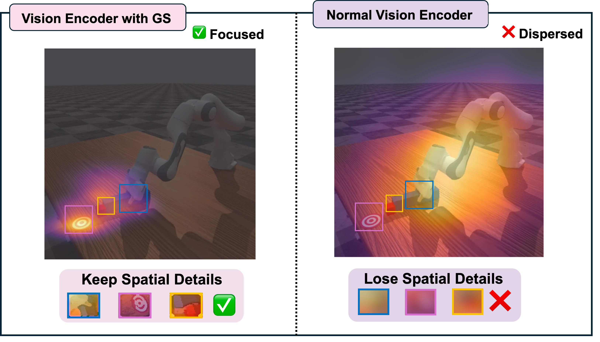
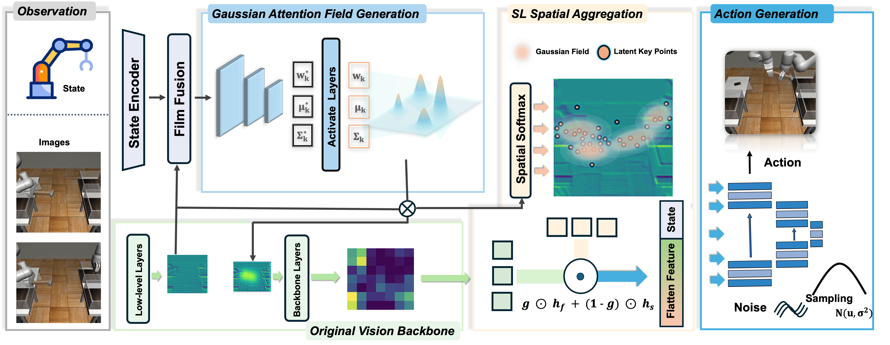
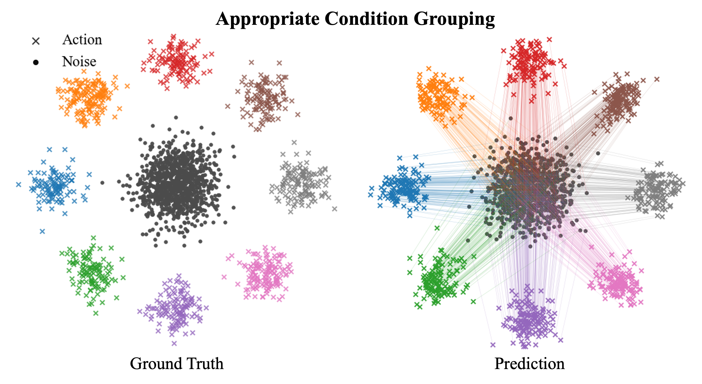
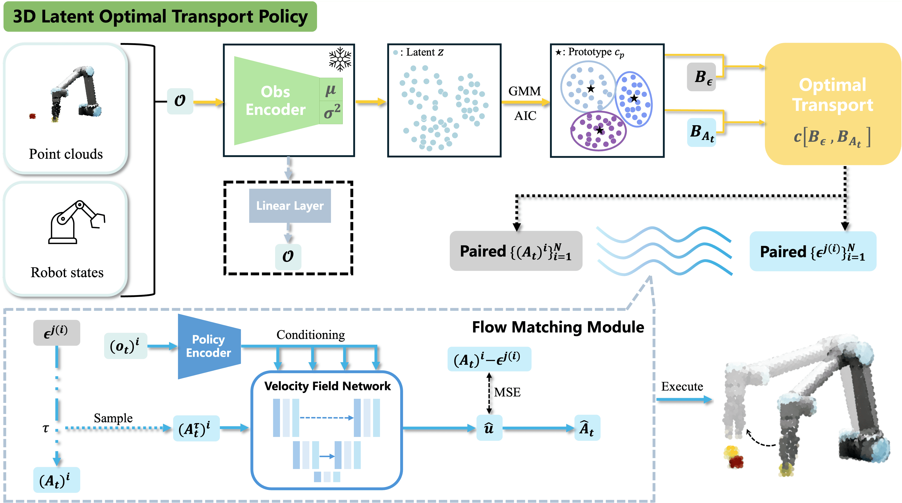
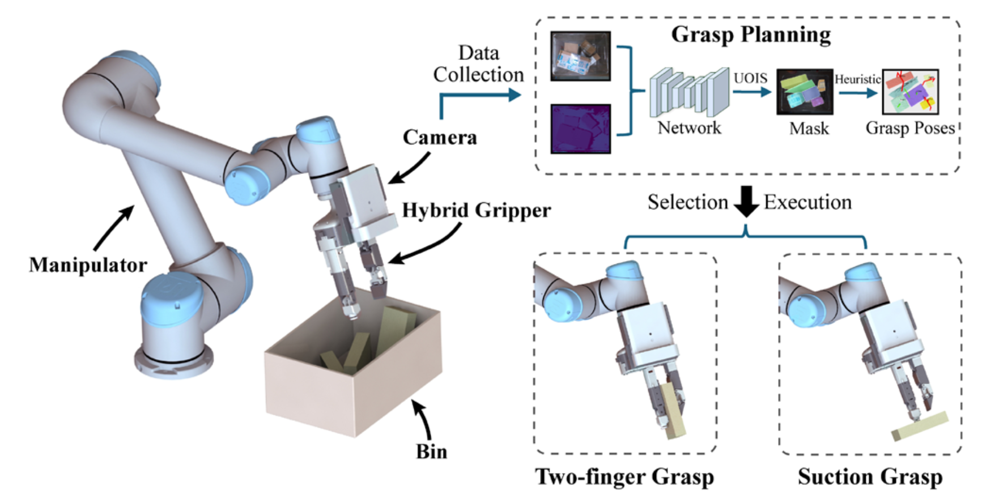
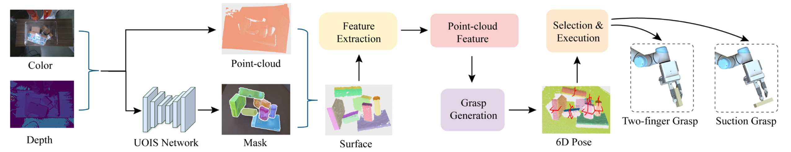
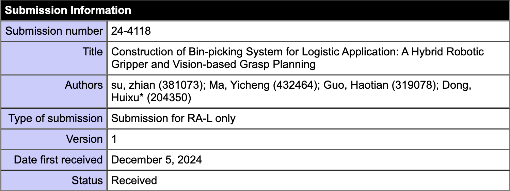

<!-- ---
permalink: /
title: "Yicheng"
author_profile: true
redirect_from: 
  - /about/
  - /about.html
header:
  show_title: false
--- -->

<section id="about_me">
    
</section>

{::options parse_block_html="false" /}
{: .content-card}
# About me

I'm Yicheng, a student passionate about AI and robotics. I hold a Bachelor's degree in Optoelectronic Information Engineering from **Zhejiang University**, where I was an active member of the **[Grasp Lab](https://grasplab2022.github.io/)**. This experience allowed me to develop a strong foundation in **robotics**, focusing on the perception of robotic grasping.

I am pursuing a Master's degree in **Machine Learning** at the School of Electrical and Electronic Engineering at **Nanyang Technological University** to further my academic and research aspirations in robotics. In parallel, I am deepening my practical expertise as an intern at [**ASTAR SIMTech ARM**](https://www.a-star.edu.sg/simtech/research/adaptive-robotics-and-mechatronics-(arm)), where I am engaged in **advanced robotics research**.

<!-- Here is my [**CV**](../assets/CV.pdf). -->
<!-- <section id="reach_me">
    
</section> -->

<section id="research_interests">
    
</section>

{: .content-card}
# Research Interests
My research focuses on the intersection of **robotic perception, control, and intelligent manipulation**. Specifically, I am interested in:

- Developing sensorimotor models to integrate perception and control for robotic manipulation.
- **Exploring machine learning methods**, such as deep learning and reinforcement learning, to enhance robotic decision-making and adaptability.
- Advancing techniques in robotic grasping and manipulation, including **vision-based control** and **multi-modal sensor fusion**, for real-world applications.

<section id="research_experience">
    
</section>

{: .content-card}
# Research Experience
## ASTAR SIMTech ARM, Singapore
**Research Intern**   
*Sep 2024 – Dec 2025*  
**Topic - Gaussian Spotlight: Enhancing Visuomotor Policy Learning via Latent Spatial Keypoint Embedding**
- We introduce a differentiable Gaussian spatial attention field that generates smooth, state-conditioned spotlight masks to highlight manipulation-relevant regions, suppress background distractions.
- A skip-layer spatial aggregation pathway is proposed to extracts fine-grained geometric cues and transforms them into latent, keypoint-like spatial embeddings, preserving task-critical spatial structure in a flexible and policy-compatible form.
- Our Gaussian Spotlight integrating both techniques and consistently achieves better performance in both simulation benchmarks and real-world experiments across various popular downstream generative policy.

   

------

**Topic - 3D-LOT Policy: Latent Optimal Transport Flow Matching for One-Step Action Generation**
- We first propose LOT and introduce it to 3D point cloud–based flow-matching policies, enabling high-quality robotic action generation from limited demonstrations.
- Our framework achieves a favorable balance between inference efficiency and policy performance, making one-step action generation practically feasible for real-time manipulation tasks.
- The effectiveness of 3D-LOT Policy is evaluated on 8 simulations and 2 real-world robot tasks, demonstrating competitive success rates together with substantially improved inference speed compared to all other baselines.

   

------

**Topic - Robotic Manipulation System using Advanced Deep Learning Technique**
- Developed a UR10e grasping system designed to operate in uncertain and dynamic clustered environments. This project involves exploring and leveraging RTDE (Real-Time Data Exchange) as a motion planning tool to enhance system reliability and responsiveness.  
- Enhanced the functionality of AnyGrasp, a state-of-the-art grasp generator, by **integrating the Grasp-1Billion dataset with MetaGraspNet**. This integration requires preprocessing and aligning the datasets to ensure consistency in their structure and arrangement, enabling seamless application and improved grasping performance.
- Conducted simulations using NVIDIA Isaac Sim, replicating the grasping system in a simulated environment and a real robot to evaluate its performance under various scenarios. Build a grasp-based data collector under NVIDIA Isaac Sim, which can collect various novel tasks to be used in imitation learning. The data collector is driven by existing AI models like RL agents and Anygrasp or pretested scripts. 
- Based on the previous data collector and 3D Diffusion Policy, I design a **contrastive framework for 3D Diffusion-based robotic manipulation**. It can use both positive and negative samples to train, which lets it have the ability to learn from failure and provides a novel way to improve imitation learning models' performance.  

          

-----
-----
## Grasp Lab, Zhejiang University  
**Graduation Project and Thesis**    
*Sep 2023 - Jun 2024*  
**Topic - Research on static and dynamic grasping of robots for warehousing and logistics applications**   
- **Constructed a geometric grasping module for grasp generation.** The method refers to the GSNet model architecture, using graspness to measure points in the point cloud suitable for grasping and extracting local and global high-dimensional point cloud features. Then, it extracts point-wise grasping degrees and subsequent viewpoint-wise grasping degrees, sets a graspness threshold to filter target point clouds, and generates grasps based on the filtered target point clouds, achieving static grasp generation.  
- **Built a dynamic tracking module based on time-based graspness.** It refers to AnyGrasp, using multi-threaded high-dimensional feature vectors to represent each grasp in each frame, calculating cosine similarity to measure the similarity between high-dimensional feature vectors, and using this to measure the correspondence of temporal dimensions between grasps in frames, achieving continuous generation of dynamic tracking poses.   
- **Established a robot motion control and path planning system.** It based on ROS, utilizes ROS's distributed communication architecture to connect and communicate between nodes. Motion control and path planning mainly use MoveIt API to write robot control modes and path planning, achieving multidimensional control of the robotic arm system.   
- **Designed static and dynamic experiments for robot new object grasping.** Static experiments include parcel grasping experiments and daily necessities grasping experiments to verify the generalization ability of the constructed robot new object grasping system. Dynamic experiments involve grasping parcels moving on conveyor belts to verify their dynamic grasping capability. Through experimental verification, this article demonstrates that the robot learning-based unknown object grasping system constructed in this article exhibits good performance in both static and dynamic object grasping scenarios.   

  

<section id="publications">
    
</section>

{: .content-card}
# Publications
<!-- ------ -->
## Gaussian Spotlight: Enhancing Visuomotor Policy Learning via Latent Spatial Keypoint Embedding *(RAL Submitted)*

Mohan Liu\*, **Yicheng Ma\***, Chang Su, Zhiyuan Yang, Shijun Yan, Pey Yuen Tao, and Haiyue Zhu†

**Abstract—** Generative visuomotor policies rely heavily on the conditioning representation to guide the synthesis of accurate and stable control sequences. Yet, standard visual encoders produce high-dimensional embeddings that often lose fine-grained spatial information while retaining substantial redundancy, weakening the policy’s ability to infer contact-relevant geometry and hindering both efficiency and performance. To address this bottleneck, we propose Gaussian Spotlight, designed to construct a latent spatial keypoint embedding that serves as a more precise and manipulation-aware conditioning signal. Gaussian Spotlight first generates a state-conditioned anisotropic Gaussian Attention Field that selectively amplifies spatial regions critical for interaction. It then transforms these enhanced regions into implicit, latent keypoint embeddings via an attention-guided skip-layer aggregation pathway, capturing precise geometric structures from early visual layers while preserving semantic context from deeper ones. The resulting conditioning representation is compact and spatially grounded, enabling diffusion- and flow-based visuomotor policies to sample high-quality actions with improved accuracy and data efficiency. Extensive experiments across diverse real-world manipulation tasks and simulation benchmarks demonstrate that Gaussian Spotlight consistently enhances policy performance and provides substantial gains over existing visual encoding strategies.

------
------

## 3D-LOT Policy: Latent Optimal Transport Flow Matching for One-Step Action Generation *(ICRA Submitted)*

**Yicheng Ma\***, Mohan Liu\*, Chang Su, Ruiteng Zhao, Zhiping Lin, and Haiyue Zhu†

<!--  -->

**Abstract—** Real-time efficiency is critical for visuomotor policy learning, as any delay in action generation can accumulate over sequential control steps, cause instability, and degrade task performance, especially for fast-changing environments. However, traditional diffusion-based and flow-based policies usually rely on multi-step inference, as single-step variants often suffer from significantly reduced accuracy, which poses a trade-off between precision and efficiency. In this work, we introduce 3D-LOT Policy, a latent prototype-guided optimal transport~(OT) flow-matching framework for effective single-step action generation. Our approach encodes 3D observations into a compact latent space that preserves task-relevant spatial information and induces prototype structures to serve as anchors for policy learning. Next, prototype-consistent OT couplings are constructed to align stochastic noise with expert actions. As a result, the proposed coupling enforces smoother optimization paths during training and improves policy stability, which ultimately enables accurate single-step action generation. Our experiments on both simulation manipulation benchmarks and real-world robot tasks demonstrate that 3D-LOT achieves lower latency while maintaining or even surpassing baseline performance with multiple steps, offering a practical and efficient solution for fast and robust visuomotor policy learning.

<!--   -->

------
------

## Construction of Bin-picking System for Logistic Application: A Hybrid Robotic Gripper and Vision-based Grasp Planning *(RAL Accepted)*

Zhian Su, **Yicheng Ma**, Haotian Guo, and Huixu Dong†

**Abstract—** An autonomous bin-picking system for grasping various cluttered packages can significantly benefit logistics by reducing manual labor and streamlining processing. The system’s key challenges involve the gripper for confined spaces and grasp planning for unseen objects with varying materials, shapes, and sizes. To address these issues effectively, we propose a bin-picking system that includes a novel gripper and a corresponding vision-based grasp planning strategy. Firstly, a multi-mode hybrid gripper combining suction and pinch is developed to enhance versatility, as pinch alone fails for oversize objects and suction struggles with uneven surfaces. By integrating the suction cup into a slender finger and employing a flipping module and underactuated linkages, the compactness and dexterity are enhanced, ensuring the handling of packages near the bin walls or corners. Secondly, a model-free heuristic grasp planning framework based on the unseen object instance segmentation (UOIS) network is designed for grasping packages in a cluttered bin, which can be applied to hybrid grippers. Thirdly, we compared the prototype’s hardware characteristics with Hand-E and conducted grasping experiments to demonstrate the functionalities of the proposed hybrid gripper. Finally, the autonomous package bin-picking system was evaluated in a simulator, achieving a 71.4% success rate, compared to mono-functional grippers such as suction (53.9%) and Hand-E (39.3%). Real-world experiments further validated its practicality, highlighting its potential in logistics scenarios.

<!--  -->

<!-- > This work has been **accepted** to ***IEEE Robotics and Automation Letters(RA-L)***. -->

------   

<!-- A paper for **IROS 2025** is being prepared now, and will be submitted before 1st March.  -->

