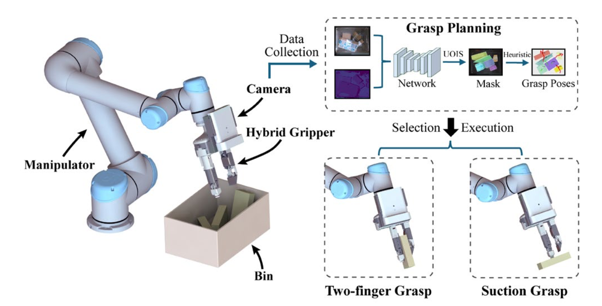

I hold a Bachelor’s degree in Optoelectronic Information Engineering from **Zhejiang University**, where I was an active member of the **[Grasp Lab](https://grasplab2022.github.io/)**. This experience allowed me to develop a strong foundation in robotics, with a particular focus on the perception of robotic grasping.

Currently, I am pursuing a Master’s degree in Machine Learning at the School of Electrical and Electronic Engineering at **Nanyang Technological University** to further my academic and research aspirations in robotics. In parallel, I am deepening my practical expertise as an intern at [**ASTAR SIMTech ARM**](https://www.a-star.edu.sg/simtech/research/adaptive-robotics-and-mechatronics-(arm)), where I am engaged in advanced robotics research.

Here is my [CV](../assets/CV.pdf).

------

Reach me
------
**Email**:  yichatma@gmail.com  

**Github**:  [yichatani](https://github.com/yichatani)  

**Wechat**:  [Ani](../images/wechat.JPG)  

Research Interests
------

My research focuses on the intersection of robotic perception, control, and intelligent manipulation. Specifically, I am interested in:

- Developing sensorimotor models to integrate perception and control for robotic grasping.
- Exploring machine learning methods, such as deep learning and reinforcement learning, to enhance robotic decision-making and adaptability.
- Advancing techniques in robotic grasping and manipulation, including vision-based control and multi-modal sensor fusion, for real-world applications.

Research Experience
------

### Research Intern  
**ASTAR SIMTech ARM, Singapore**  
*Sep 2024 – Present*  

- Developing **sensorimotor integration models** for advanced robotic manipulation tasks, focusing on **grasp planning and control**.  
- Implementing **deep learning algorithms** to enhance robotic perception and adaptability in unstructured environments.  
- Conducting experiments on **multi-modal sensor fusion** to improve object detection and grasp stability.  
- Collaborating with a multidisciplinary team to design and validate real-world robotic solutions, achieving a [specific measurable impact, e.g., "20% improvement in grasp success rate"].  

### Graduation Project and Research Intern
**Grasp Lab, Zhejiang University**  
*Sep 2023 - Jun 2024*

Publications
------

**Construction of Bin-picking System for Logistic Application: A Hybrid Robotic Gripper and Vision-based Grasp Planning**  
Zhian Su, **Yicheng Ma**, Haotian Guo, and Huixu Dong  
*IEEE Robotics and Automation Letters(RA-L), 2024*  **（[Under Review, ](https://mail.google.com/mail/u/0/?ui=2&ik=4037973d15&view=lg&permmsgid=msg-f:1817610031163563325))**

-----

A paper for **IROS 2025** is being prepared now, and will be submitted before 1st March. 

